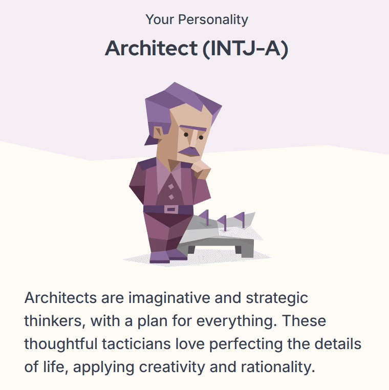

<!-- # 👋 Hi, I'm Lvyizhuo -->

  

### 👨‍💻 About Me

<table>
  <tr>
    <td width="55%" valign="top">
      
I am a Master's student at the <b><a href="http://www.sdai.net/">Shandong Artificial Intelligence Institute</a></b>, supervised by <b><a href="https://teacher.qlu.edu.cn/rgzn/dc2/main.htm">Chong Di</a></b>.

      
I build scalable web systems and AI‑driven applications with a focus on <b>simplicity, performance, and engineering quality</b>.

      <ul>
        <li>🔭 <b>Focus:</b> RL, Data Mining, and LLMs (TAPDIM Framework)</li>
        <li>⚙️ <b>Projects:</b> HRL-DIM & AI-driven policy consultation agents</li>
        <li>🌱 <b>Learning:</b> Modern web architecture & efficient backend systems</li>
      </ul>
      

        <!-- 
         -->
        Taking paid coding commissions. 
        You can reach me here:
      <ul>
        <li> <b>QQ:</b> <a href="https://qm.qq.com/q/GuULJs94S6">1921708385</a></li>
        <li> <b>WeChat:</b> <a href="./WeChat.jpg">./WeChat.jpg</a></li>
        <li> <b>Email:</b> <a href="mailto:lvonezhuo@163.com">lvonezhuo@163.com</a></li>
      </ul>
      

    </td>
    <td width="45%" align="center">
      
    </td>
  </tr>
</table>

### 🛠️ Tech Stack

  <!-- 1. 蓝色系 → 由浅到深 -->
  
   
  
  
  
  
  
  
  

  <!-- 2. 紫色系 → 由浅到深 -->
  
  
  

  

  <!-- 3. 红色/橙色系 → 由浅到深 -->
  
  
  
  
  
  
  
  
  
  
  
  
  
  
  <!-- 4. 绿色系 → 由浅到深 -->
  
  
  
  

  
  
  
  
  

<!-- Metrics -->

  

  <i>"Build simple. Scale smart."</i>

<!--Footer-->

  

